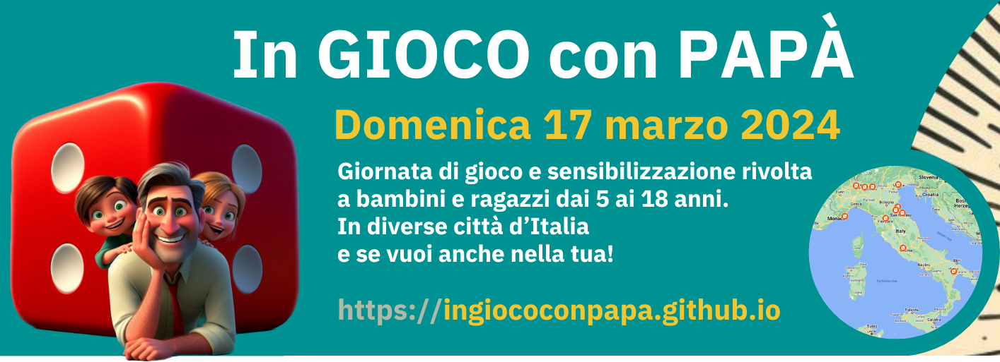
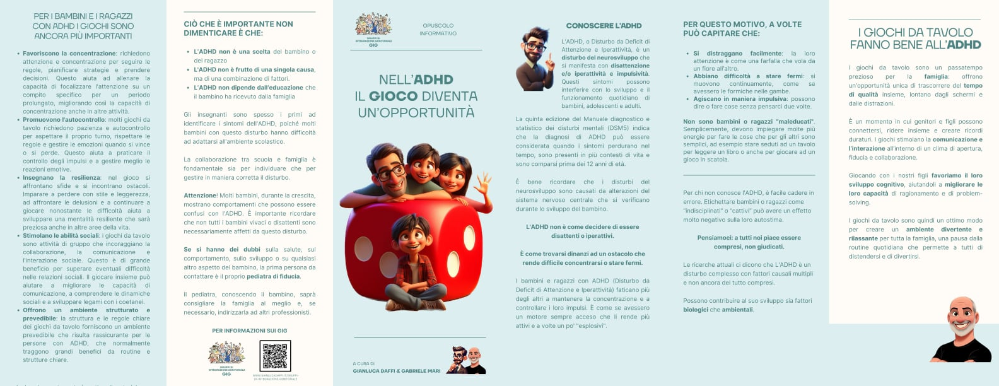

# In GIOCO con PAPÀ

> **Domenica 17 Marzo 2024: una giornata di gioco** e sensibilizzazione rivolta a bambini e ragazzi dai 5 ai 18 anni intorno alla **Festa del Papà**, in **diverse città d'Italia**.

Qui trovate tutte le informazioni per partecipare ad un incontro o organizzare un nuovo evento nella tua città.

## Chi siamo
**Comitato Organizzatore**  
[Gianluca Daffi](https://www.gianlucadaffi.it), [Gabriele Mari](https://www.facebook.com/educatoriludici), [Stefano Cecere](https://linktr.ee/cecere), Jennifer Francioli, [Emanuele Cristallo](https://www.zioludovico.it), Michela Savoldi, Marcello Scutra, Fausto Regosi.

---

## Calendario

**Febbraio** (individuare tutte le città interessate)

- Giovedì 22 - 19:15 | breve **riunione di aggiornamento** con i nuovi organizzatori
- Giovedì 29 - 19:00 | breve **riunione di aggiornamento** con i nuovi organizzatori

**Marzo** (Diffusione e formazione)

- Martedì 5 - 20:30 | **Seminario online** su ADHD e DOP per i volontari
- Martedì 12 - 20:30 | **Seminario online** sulle regole dei giochi per i volontari
- Giovedì 14 - 19:00 | ultimo aggiornamento tra gli organizzatori
- **Domenica 17: EVENTO** (ogni città con suo orario)
    - alle 15:30 faremo una videochiamata tra tutte le città

---

## Partecipazione e contatti {#contatti}

**Per partecipare o proporre di organizzare una nuova città**, compilare questa [Form di partecipazione :fontawesome-solid-paper-plane:](https://forms.gle/jHMDSRyyoLyGsMvv7){ .md-button .md-button--primary }  

Per gli **organizzatori** di eventi, abbiamo una **mailing list**: [https://groups.google.com/g/ingiococonpapa](https://groups.google.com/g/ingiococonpapa) a cui sarete invitati dopo che avrete compilato la form e ci saremo sentiti.

Per informazioni: [Gianluca Daffi](mailto:daffi.gianluca@gmail.com) - Per questo sito e comunicazione: [Stefano Cecere](mailto:stefano.cecere@gmail.com)

---

## Mappa Eventi {#mappa}

!!! info
    Per proporre nuovi eventi compilare questa 👉🏼 [form di contatto](https://forms.gle/jHMDSRyyoLyGsMvv7)  
    Per apportare modifiche scrivere in [mailing list](https://groups.google.com/g/ingiococonpapa)

<iframe src="https://www.google.com/maps/d/u/0/embed?mid=1UuIn5vNkS8Sx4IpgfZJcW9S31Q_59qQ&ehbc=2E312F&noprof=1" width="100%" height="620"></iframe>

### Brescia ✅
Dove: **Bimbo Chiama Bimbo** - Via Sant’Antonio, 16 (Zona Mompiano), Brescia  
Orario: Dalle 14:30  
Referente: **Gianluca Daffi** - [email](mailto:daffi.gianluca@gmail.com)

### Domodossola  ✅
Dove:  
Referente: **Francioli Jennifer** - [email](mailto:francij75@gmail.com)

### Firenze ✅
Dove: **Casa del Popolo di Settignano** - via San Romano 1, Firenze - [sito](https://cdp.settignano.org/)  
Orario: 11:00 - 16:00 (con pranzo al bar)  
Referente: **Stefano Cecere** - [2042ed.org](https://2042ed.org) - [email](mailto:stefano.cecere@gmail.com)

### Giavera del Montello (Treviso) ✅
Dove: Sale parrocchiali di Cusignana, piazza IV Novembre - Giavera del Montello  
Referente: **Erika Franceschini** - [email](mailto:erikafranceschini2@gmail.com) - 3493790747  

### Imperia  ✅
Dove: Centro Aggregativo Il Puerto - Via Matteotti 31, Imperia  
Referente: Fabio Boero - [email](mailto:fabio.boero@centroancora.it)

### Mantova ✅
Dove: Biblioteca Mediateca "Gino Baratta", Corso Garibaldi 88, Mantova  
Referente: **Filomena Cesarano** - Associazione Ludico Culturale Amici Ludici Aps - [email](mailto:cesarano.filomena87@gmail.com)

### Matera ✅
Dove: LUMACA  
Referente: **Emanuele Cristallo** - [email](mailto:zioludovico@gmail.com)

### Ravenna ✅
Dove: Centro RicreAzioni, via Don Carlo Sala 7, Ravenna  
Orario: 15:00 - 18:00  
Referente: **Gabriele Mari** - [Educatori Ludici](https://www.facebook.com/educatoriludici) - [email](mailto:progetti.innovativi@cooplapieve.it) - 3281552787  

### Venezia ✅
Dove: La Casa delle Meraviglie, calle Larga Lavraneri 3, Venezia  
Referente: Elisa Carmen Brumat - [email](mailto:ludoteca.babajaga@gmail.com)  

---
### Alì Terme (Messina)
Referente: Rachele Bernava

### Assisi
Referente: Giacomo Piccioni

### Bergamo - Treviglio 
Referente: Antonio Ciocca

### Castelluccio Superiore (Potenza)
Referente: Isabella Labanca 

### Cremona
Referente: Alberto

### Dosson (Treviso) 
Referente: **Rossella Frascogna**

### Grosseto
Referente: Carlo Donadio  

### Lecce
Referente: Diego Solari

### Legnano
Referente: Valentina Giurbino  

### Palermo
Referente: Giana Di Lorenzo

### Rescaldina (Milano)
Referente: Fabio Gianquinto

### Rimini
Referente: Riccardo Nicolini

### Rochis (33050 Udine)
Referente: Roberta Cannellotto

### Salerno
Referente: Massimiliano Sabato

### Taranto
Referente: Antonella Travaglini 

### Torino
Rferente: Pietro Nigro

### Treviglio
Referente: Antonio Ciocca

---

## Presentazione
Le persone con difficoltà del comportamento possono affrontare una serie di sfide che vanno oltre le difficoltà cognitive e comportamentali.  

- **Difficoltà di socializzazione** che possono rendere difficile per loro costruire relazioni significative e sentirsi accettate dai coetanei. Possono sentirsi escluse, isolate o incomprese.
- **Bassa autostima** che può portare le persone con difficoltà del comportamento a sentirsi come se non fossero abbastanza brave, intelligenti o capaci. Ciò può portare a problemi di depressione, ansia e isolamento sociale.
- **Disturbi emotivi**, come l'ansia o la depressione, che sono più comuni nelle persone con difficoltà del comportamento. Questi disturbi possono avere un impatto significativo sulla vita quotidiana, rendendo difficile concentrarsi, prendere decisioni e gestire lo stress.

Questi aspetti sono interconnessi e possono alimentarsi a vicenda.  

Ad esempio, le difficoltà di socializzazione possono portare a bassa autostima, che può portare a disturbi emotivi. Questi disturbi possono, a loro volta, rendere più difficile per le persone con difficoltà del comportamento concentrarsi e socializzare in maniera soddisfacente.

È importante promuovere sempre **nuove modalità per favorire la conoscenza dei disturbi del comportamento** e dar vita a **esperienze che sostengano l'inclusione** dei soggetti che ne sono colpiti.

### Obiettivi
L'evento "In Gioco con Papà", che si svolgerà Domenica 17 Marzo 2024 in differenti città italiane, si pone come obiettivo generale quello di **promuovere una cultura dell’inclusione nei riguardi dei soggetti con difficoltà del comportamento**, cogliendo come occasione la una giornata di festa collegata ad una ricorrenza che è sia religiosa che civile, avendo come significato non solo la celebrazione della figura del padre ma, più in generale, di tutti coloro che, senza pregiudizi, sono disponibili ad accogliere, prendersi cura dell’altro e mettersi ogni giorno in gioco per dare ad ogni l’opportunità di crescere serenamente.

Gli obiettivi di dettaglio sono:

- **sensibilizzare** la popolazione sulle difficoltà e sui disturbi del comportamento
- **favorire il coinvolgimento dei papà** in attività di gioco e conoscenza con i propri figli
- **promuovere occasioni di socializzazione** per i bambini/ragazzi con difficoltà/disturbi del comportamento

---

## Pianificazione dell’evento

### FASE 1 - incontri preliminari
Individuare un gruppo di papà che si renda disponibile nel gestire mezza giornata di attività ludica con giochi in scatola che verranno indicati agli organizzatori del territorio da un comitato centrale. I papà potranno decidere chi invitare a questo evento, come promuoverlo e come organizzare/gestire i tavoli da gioco.

I papà volontari verranno invitati a partecipare a **due incontri formativi online**:

1. **Nel primo incontro** (Martedì 5 Marzo) a cura del Prof. Gianluca Daffi e della D.ssa Jeniffer Francioli, verranno presentate le **caratteristiche dell'ADHD** (deficit dell'attenzione e iperattività) **e del DOP** (disturbo oppositivo provocatorio), al fine di preparare i papà alla gestione dei bambini/ragazzi che potrebbero presentarsi a giocare. La conoscenza di queste difficoltà è importante per promuovere una cultura inclusiva.
2. **Nel secondo incontro** (Martedì 12 Marzo) a cura di Gabriele Mari, Stefano Cecere ed Emanuele Cristallo, **verranno presentate le regole dei giochi**  suggeriti.

### FASE 2 - organizzazione

**Individuare una location** che permetta ai papà volontari di giocare comodamente con i bambini/ragazzi partecipanti all'evento. La location deve essere comunicata al comitato scientifico almeno 10 giorni prima dell'evento in modo da poter aggiornalre la lista degli eventi affiliati all'iniziativa.

**Ogni organizzazione territoriale è responsabile del recupero dei giochi utili per l’evento.**  
I giochi dovranno essere in possesso del gruppo di volontari in occasione del secondo incontro formativo online.  
Qualora alcuni giochi suggeriti non fossero disponibili, l'organizzatore territoriale dovrà avvisare un membro del comitato stesso. Se possibile, il comitato fornirà un aiuto per recuperare il gioco mancante.

Si ricorda che la data dell'evento è stabilita dal comitato organizzativo centrale e ha validità nazionale, tuttavia **ogni territorio è libero di definire l’orario di inizio e fine della propria iniziativa**.

### FASE 3 - stampa materiale

**Stampare il materiale informativo sulle difficoltà del comportamento e sul gioco come veicolo per promuovere l’inclusione e favorire la socializzazione**.  
Per la stampa potete mandare il pdf in copisteria o usare un servizio online come [www.stampaprint.net](https://www.stampaprint.net) che offre un buon rapporto qualità/prezzo.  
Ogni territorio è libero di scegliere quante copie stampare e diffondere in base alle proprie esigenze. Tuttavia, si ricorda che il fine ultimo dell'evento è la sensibilizzazione sui temi riportati sui materiali informativi.

## Brochure Informativa

### Conoscere l'ADHD
L'ADHD, o Disturbo da Deficit di Attenzione e Iperattività, è un **disturbo del neurosviluppo** che si manifesta con disattenzione e/o iperattività e impulsività.
Questi sintomi possono interferire con lo sviluppo e il funzionamento quotidiano di bambini, adolescenti e adulti. La quinta edizione del Manuale diagnostico e statistico dei disturbi mentali (DSM5) indica che la diagnosi di ADHD può essere considerata quando i sintomi perdurano nel tempo, sono presenti in più contesti di vita e sono comparsi prima dei 12 anni di età. È bene ricordare che i disturbi del neurosviluppo sono causati da alterazioni del sistema nervoso centrale che si verificano durante lo sviluppo del bambino.

**L'ADHD non è come decidere di essere disattenti o iperattivi.**  
**È come trovarsi dinanzi ad un ostacolo che rende difficile concentrarsi o stare fermi.**

I bambini e ragazzi con ADHD faticano più degli altri a mantenere la concentrazione e a controllare i loro impulsi. È come se avessero un motore sempre acceso che li rende più attivi e a volte un po' "esplosivi".

### I giochi da tavolo fanno bene

I giochi da tavolo sono un passatempo prezioso per la **famiglia**: offrono un'opportunità unica di trascorrere del **tempo di qualità** insieme, lontano dagli schermi e dalle distrazioni. È un momento in cui genitori e figli possono connettersi, ridere insieme e creare ricordi duraturi. I giochi stimolano la **comunicazione e l’interazione** all’interno di un clima di apertura, fiducia e collaborazione. Giocando con i nostri figli **favoriamo il loro sviluppo cognitivo**, aiutandoli a **migliorare le loro capacità** di ragionamento e di problem-solving.  
I giochi da tavolo sono quindi un ottimo modo per creare un **ambiente divertente e rilassante** per tutta la famiglia, una pausa dalla routine quotidiana che permette a tutti di distendersi e di divertirsi.

Per i bambini e i ragazzi con ADHD, poi, i giochi sono ancor più importanti, perché ne supportano lo sviluppo e il benessere:

1. **Favoriscono la concentrazione**: i giochi da tavolo richiedono attenzione e concentrazione per seguire le regole, pianificare strategie e prendere decisioni. Questo aiuta ad allenare la capacità di focalizzare l'attenzione su un compito specifico per un periodo prolungato, migliorando così la capacità di concentrazione anche in altre attività.
2. **Promuovono l'autocontrollo**: molti giochi da tavolo richiedono pazienza e autocontrollo per aspettare il proprio turno, rispettare le regole e gestire le emozioni quando si vince o si perde. Questo aiuta a praticare il controllo degli impulsi e a gestire meglio le reazioni emotive.
3. **Insegnano la resilienza**: nel gioco si affrontano sfide e si incontrano ostacoli. Imparare a perdere con stile e leggerezza, ad affrontare le delusioni e a continuare a giocare nonostante le difficoltà aiuta a sviluppare una mentalità resiliente che sarà preziosa anche in altre aree della vita.
4. **Stimolano le abilità sociali**: i giochi da tavolo sono attività di gruppo che incoraggiano la collaborazione, la comunicazione e l'interazione sociale. Questo è di grande beneficio per superare eventuali difficoltà nelle relazioni sociali. Il giocare insieme può aiutare a migliorare le capacità di comunicazione, a comprendere le dinamiche sociali e a sviluppare legami con i coetanei.
5. **Offrono un ambiente strutturato e prevedibile**: la struttura e le regole chiare dei giochi da tavolo forniscono un ambiente prevedibile che risulta rassicurante per le persone con ADHD, che normalmente traggono grandi benefici da routine e strutture chiare.

## Materiali da scaricare {#materiali}

- :fontawesome-solid-book: [Brochure Informativa su Giochi e ADHD](./assets/pdf/brouchure-giochi-e-adhd.pdf) 
Da scaricare e stampare

- :fontawesome-solid-book: [Volantino per la diffusione](./assets/pdf/volantino-papaingioco-17marzo2024.pdf) 
Da scaricare e stampare

- :fontawesome-solid-book: [Volantino (Canva) da modificare](https://www.canva.com/design/DAF7qEQOsv4/RMtEhlKL-4U2PzKCOhl5Nw/edit)  personalizzabile con luogo e orari del proprio evento

---

## Lista dei giochi proposti

!!! warning "Attenzione"
    Gli organizzatori territoriali **non** dovranno utilizzare tutti i giochi riportati nella lista, ma selezionarne solo alcuni in base alle caratteristiche dell’evento concordato con il comitato organizzativo centrale.

### Per i piccoli

| Titolo | Editore | Scheda BGG |
|---|---|---|
| C’era un Pirata | Erickson | [scheda BBG](https://boardgamegeek.com/boardgame/253115/cera-un-pirata) |
| A caccia di conchiglie | Erickson | [scheda BBG](https://boardgamegeek.com/boardgame/400811/caccia-di-conchiglie) |
| Taco gatto cacio capra pizza | Ghenos | [scheda BBG](https://boardgamegeek.com/boardgame/253664/taco-cat-goat-cheese-pizza) |
| ⁠Ice cool | Oliphante   | [scheda BBG](https://boardgamegeek.com/boardgame/177524/icecool) |
| Catan junior |  | [scheda BBG](https://boardgamegeek.com/boardgame/184842/catan-junior) |
| Fantascatti / Fantablitz |  | [scheda BBG](https://boardgamegeek.com/boardgame/83195/ghost-blitz) |

### Per i grandi

| Titolo | Scheda BGG |
|---|---|
| Saboteur | [scheda BBG](https://boardgamegeek.com/boardgame/9220/saboteur) |
| ⁠Diamant |  [scheda BBG](https://boardgamegeek.com/boardgame/15512/incan-gold) |
| ⁠Carcassonne |  [scheda BBG](https://boardgamegeek.com/boardgame/822/carcassonne) |
| ⁠King of Tokyo / King of monster island |  [scheda BBG](https://boardgamegeek.com/boardgame/70323/king-tokyo) |
| ⁠⁠Crossing |  [scheda BBG](https://boardgamegeek.com/boardgame/172971/crossing) |
| Splendor / Splendor Marvel |  [scheda BBG](https://boardgamegeek.com/boardgame/148228/splendor) |

---

## Diffusione

Usiamo tutti l'**hashtag** `#ingiococonpapa`  

Ovviamente siete liberi anzi incoraggiati a condividere questa iniziativa.
Basta condividere questo link [ingiococonpapa.github.io](https://ingiococonpapa.github.io) o usare questa immagine nei sociale media:

## FAQ (Domande e Risposte) {#faq}

- **Cosa devo fare se voglio solo partecipare?**  
Registrarsi con l'apposita [Form](https://forms.gle/jHMDSRyyoLyGsMvv7)
Sarete invitati ad una mailing list degli organizzatori e lì fornirete i dettagli del vostro evento, che saranno pubblicati su questo sito.

- **Devo conoscere i giochi prima di parteciparvi?**  
Sarebbe meglio di sì, per questo terremo un incontro formativo online la settimana prima, per spiegare i giochi a chi si sarà già registrato.  Inoltre aggiungeremo alle schede di tutti i giochi dei video tutorial in italiano.

- **Quanto durerà l'evento?**  
A seconda degli organizzatori, c'è chi lo farà di mattina, chi di pomeriggio, chi per tutto il giorno.  DI sicuro faremo una videochiamata tutti insieme alle 15:30

- **Quanto costerà parteciparvi?**  
Gli eventi sono gratuiti. Ogni gruppo valuterà se chiedere un piccolo rimborso spese o autofinanziarsi l'acquisto dei giochi.

- **Ci sarà da mangiare o pranzo?**  
Ogni gruppo deciderà e organizzerà in autonomia.

- **Non c'è un evento nella mia città, cosa posso fare?**  
Puoi provare ad organizzare tu un incontro. Basta essere in 3/4 genitori volontari. In questo sito troverai tutte le informazioni utili per poterlo fare in tranquillità e ci saranno due incontri formativi ad hoc.

- **L'evento è rivolto a genitori/bambini o allargato?**  
I protagonisti saranno i papà insieme ai propri figli.  
Se poi intorno ci saranno anche altri che giocano, non si può mandarli via, ma dalla convocazione e dalla comunicazione deve essere chiaro chi stiamo cercando.

- **I papà da coinvolgere: giocano con i figli, o collaorano e basta?**  
I collaboratori per l'evento possono essere vari, non necessariamente papà con i propri figli. L'importante è che gli invitati siano appunto i papà + figli.

- **Per l'evento sarebbe meglio un salone unico grande oppure delle stanze più piccole?**  
Tutto quello che si trova va bene. Ma potendo scegliere valutare sopratutto l'insonorizzazione degli spazi: meglio due o più spazi più piccoli rispetto ad un grande salone che rimbomba.

- **Come nasce questa iniziativa?**  
Da un'idea di Gianluca Daffi che voleva fare un incontro ludico papà / figli con disturbi del comportamento e da alcune telefonate con amici educatori ludici residenti in altre città.
