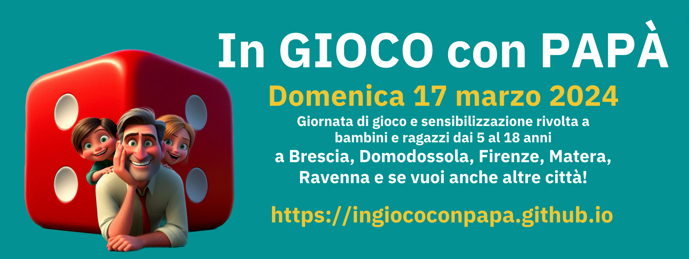

# IN GIOCO CON PAPÀ
**Domenica 17 Marzo 2024**  
Giornata di gioco e sensibilizzazione rivolta a bambini e ragazzi dai 5 al 18 anni

## Chi siamo
**Comitato Organizzativo:**
Gianluca Daffi, Gabriele Mari, Stefano Cecere, Jennifer Francioli, Emanuele Cristallo, Michela Savoldi, Marcella Scutra, Fausto

## Contatti per partecipare

Compilare questa [Form di contatto](https://forms.gle/jHMDSRyyoLyGsMvv7)

## Presentazione
Le persone con difficoltà del comportamento possono affrontare una serie di sfide che vanno oltre le difficoltà cognitive e comportamentali.  

- **Difficoltà di socializzazione** che possono rendere difficile per loro costruire relazioni significative e sentirsi accettate dai coetanei. Possono sentirsi escluse, isolate o incomprese.
- **Bassa autostima** che può portare le persone con difficoltà del comportamento a sentirsi come se non fossero abbastanza brave, intelligenti o capaci. Ciò può portare a problemi di depressione, ansia e isolamento sociale.
- **Disturbi emotivi**, come l'ansia o la depressione, che sono più comuni nelle persone con difficoltà del comportamento. Questi disturbi possono avere un impatto significativo sulla vita quotidiana, rendendo difficile concentrarsi, prendere decisioni e gestire lo stress.

Questi aspetti sono interconnessi e possono alimentarsi a vicenda. 

Ad esempio, le difficoltà di socializzazione possono portare a bassa autostima, che può portare a disturbi emotivi. Questi disturbi possono, a loro volta, rendere più difficile per le persone con difficoltà del comportamento concentrarsi e socializzare in maniera soddisfacente.

È importante promuovere sempre **nuove modalità per favorire la conoscenza dei disturbi del comportamento** e dar vita a **esperienze che sostengano l'inclusione** dei soggetti che ne sono colpiti.

## Obiettivi
L'evento "In gioco con papà", che si svolgerà Domenica 17 marzo 2024 in differenti città italiane , si pone come obiettivo generale quello di promuovere una cultura dell’inclusione nei riguardi dei soggetti con difficoltà del comportamento, cogliendo come occasione la una giornata di festa collegata  ad una ricorrenza che è sia religiosa che civile, avendo come significato non solo la celebrazione della figura del padre ma, più in generale, di tutti coloro che, senza pregiudizi, sono disponibili ad accogliere, prendersi cura dell’altro e mettersi ogni giorno in gioco per dare ad ogni l’opportunità di crescere serenamente.

Gli obiettivi di dettaglio sono:

- Sensibilizzare la popolazione sulle difficoltà e sui disturbi del comportamento,
- favorire il coinvolgimento dei papà in attività di gioco e conoscenza con i propri figli,
- promuovere occasioni di socializzazione per i bambini/ragazzi con difficoltà/disturbi del comportamento.

## Pianificazione dell’evento
La pianificazione dell’evento prevede nel dettaglio:

### FASE 1 - incontro preliminare
Individuare un gruppo di papà che si renda disponibile nel gestire mezza giornata di attività ludica con giochi in scatola che verranno indicati agli organizzatori del territorio da un comitato centrale. I papà potranno decidere chi invitare a questo evento, come promuoverlo e come organizzare/gestire i tavoli da gioco. 

I papà volontari verranno invitati a partecipare a due brevi incontri formativi online, della durata di circa un'ora ciascuno.
Nel primo incontro, a cura del Prof. Gianluca Daffi e della D.ssa Jeniffer Francioli, verranno presentate le caratteristiche dell'ADHD (deficit dell'attenzione e iperattività) e del DOP (disturbo oppositivo provocatorio), al fine di preparare i papà alla gestione dei bambini/ragazzi che potrebbero presentarsi a giocare. La conoscenza di queste difficoltà è importante per promuovere una cultura inclusiva.
Nel secondo incontro, a cura di XXX, verranno presentate le regole dei giochi in scatola selezionati dal comitato scientifico dell'evento.

Al termine della formazione online, i papà volontari riceveranno del materiale informativo a supporto. Inoltre, durante tutta la giornata di domenica 17 marzo, saranno affiancati da un responsabile dell'evento competente sui giochi proposti.

### FASE 2 - organizzare evento

Individuare una location che permetta ai papà volontari di giocare comodamente con i bambini/ragazzi partecipanti all'evento. La location deve essere comunicata al comitato scientifico almeno 10 giorni prima dell'evento, in modo da poter inserire l'evento territoriale nella lista degli eventi affiliati all'iniziativa.

Dopo aver ricevuto comunicazione relativa alla location, il comitato scientifico invierà a tutti gli organizzatori che desiderano attivare l'evento presso il proprio territorio la lista dei giochi selezionati. I giochi devono essere in possesso del gruppo di volontari in occasione del secondo incontro formativo online.

Ogni organizzazione territoriale è responsabile del recupero dei giochi utili per l’evento. 

Qualora tra i giochi indicati dal comitato ve ne fossero alcuni non disponibili, l'organizzatore territoriale dovrà  avvisare un membro del comitato stesso. Se possibile, il comitato fornirà un aiuto per recuperare il gioco mancante.

Si ricorda che la data dell'evento è stabilita dal comitato organizzativo centrale e ha validità nazionale, tuttavia ogni territorio è libero di definire l’orario di 'inizio e fine della propria iniziativa.

Il comitato organizzativo centrale ha realizzato un depliant con un format comune per promuovere l’evento, tale depliant verrà inviato ad ogni responsabile territoriale per poter essere personalizzato inserendo le informazioni relative alla location e agli orario di inizio/fine evento.

### FASE 3 - stampa materiale

Stampare il materiale informativo sulle difficoltà del comportamento e sul gioco come veicolo per promuovere l’inclusione e favorire la socializzazione, (un Depliant A4 piegato a metà) che verrà inviato dal comitato scientifico agli organizzatori di ogni evento territoriale e che dovrà essere diffuso in occasione dell’evento stesso.
Il materiale verrà inviato in formato PDF, strutturato per la stampa online. Gli organizzatori territoriali potranno, ma non necessariamente dovranno, fare riferimento al servizio online www.stampaprint.net, che offre un buon rapporto qualità/prezzo.

Ogni territorio è libero di scegliere quante copie stampare e diffondere, in base alle proprie esigenze. Tuttavia, si ricorda che il fine ultimo dell'evento è la sensibilizzazione sui temi riportati sui materiali informativi.

## CRONOGRAMMA

Febbraio

- Individuazione dei volontari
- Individuazione delle location

Marzo

- 5 marzo 20.30 online Seminario su ADHD e DOP per i volontari
- 12 marzo 20:30 online Seminario sulle regole dei giochi per i volontari
- 17 marzo: EVENTO

## I giochi da tavolo fanno bene!

I giochi da tavolo sono un passatempo prezioso per la famiglia: offrono un'opportunità unica di trascorrere del tempo di qualità insieme, lontano dagli schermi e dalle distrazioni. 
È un momento in cui genitori e figli possono connettersi, ridere insieme e creare ricordi duraturi. I giochi stimolano la comunicazione e l’interazione all’interno di un clima di apertura, fiducia e collaborazione. 
Giocando con i nostri figli favoriamo il loro sviluppo cognitivo, aiutandoli a migliorare le loro capacità di ragionamento e di problem-solving.
I giochi da tavolo sono quindi un ottimo modo per creare un ambiente divertente e rilassante per tutta la famiglia, una pausa dalla routine quotidiana che permette a tutti di distendersi e di divertirsi.

Per i bambini e i ragazzi con ADHD, poi, i giochi sono ancor più importanti, perché ne supportano lo sviluppo e il benessere:

1. **Favoriscono la concentrazione**: i giochi da tavolo richiedono attenzione e concentrazione per seguire le regole, pianificare strategie e prendere decisioni. Questo aiuta ad allenare la capacità di focalizzare l'attenzione su un compito specifico per un periodo prolungato, migliorando così la capacità di concentrazione anche in altre attività.

2. **Promuovono l'autocontrollo**: molti giochi da tavolo richiedono pazienza e autocontrollo per aspettare il proprio turno, rispettare le regole e gestire le emozioni quando si vince o si perde. Questo aiuta a praticare il controllo degli impulsi e a gestire meglio le reazioni emotive.

3. **Insegnano la resilienza**: nel gioco si affrontano sfide e si incontrano ostacoli. Imparare a perdere con stile e leggerezza, ad affrontare le delusioni e a continuare a giocare nonostante le difficoltà aiuta a sviluppare una mentalità resiliente che sarà preziosa anche in altre aree della vita.

4. **Stimolano le abilità sociali**: i giochi da tavolo sono attività di gruppo che incoraggiano la collaborazione, la comunicazione e l'interazione sociale. Questo è di grande beneficio per superare eventuali difficoltà nelle relazioni sociali. Il giocare insieme può aiutare a migliorare le capacità di comunicazione, a comprendere le dinamiche sociali e a sviluppare legami con i coetanei.

5. **Offrono un ambiente strutturato e prevedibile**: la struttura e le regole chiare dei giochi da tavolo forniscono un ambiente prevedibile che risulta rassicurante per le persone con ADHD, che normalmente traggono grandi benefici da routine e strutture chiare.

## Lista dei giochi proposti

Attenzione: Gli organizzatori territoriali non dovranno utilizzare tutti i giochi riportati nella lista, ma selezionare solo alcuni tra i giochi proposti in base alle caratteristiche dell’evento concordato con il comitato organizzativo centrale.

### Per i piccoli

| Titolo  | Editore  |Età consigliata  | Prezzo  |
|---|---|---|---|
| C’era un Pirata  | Erickson  | 5 - 10  | 16,90 €  |
| A caccia di conchiglie  | Erickson  |   | 18,50   |
| Taco gatto cacio capra pizza  |   |   |   |
| ⁠Ice cool  |   |   |   |
| Catan junior  |   |   |   |
| Fantascatti/Fantablitz  |   |   |   |

### Per i grandi

| Titolo  | Editore  |Età consigliata  | Prezzo  |
|---|---|---|---|
| Saboteur  |   |   |   |
| ⁠Diamant  |   |   |    |
| ⁠Carcassonne  |   |   |   |
| ⁠King of tokyo / King of monster island  |   |   |   |
| ⁠⁠Crossing  |   |   |   |
| Splendor/Splendor Marvel  |   |   |   |

## Città operative

### Brescia
Presso  
Referente: Gianluca Daffi

### Domodossola
Presso  
Referente: 

### Firenze
Presso la Casa del Popolo di Settignano - via San Romano 1 - Firenze - [sito](https://cdp.settignano.org/)  
Referente: Stefano Cecere - stefano.cecere@gmail.com / 3358301741

### Matera
Presso  
Referente: Emanuele Cristallo 

### Ravenna
Presso  
Referente: Gabriele Mari 

## Materiali da scaricare

- :fontawesome-solid-book: [Brochure](https://docs.google.com/document/d/1TXcsv-yJk83hm7wxReEv1-4jajmx7DY-D52HlnLGxyE/edit)
 Le linee guida per l'evento

- :fontawesome-solid-book: [Volantino](./assets/pdf/volantino-papaingioco-17marzo2024.pdf) 
Da scaricare e stampare

- :fontawesome-solid-book: [Volantino Canva]([./assets/pdf/volantino-papaingioco-17marzo2024.pdf](https://www.canva.com/design/DAF7qEQOsv4/RMtEhlKL-4U2PzKCOhl5Nw/edit))  personalizzabile con luogo e orari del proprio evento

