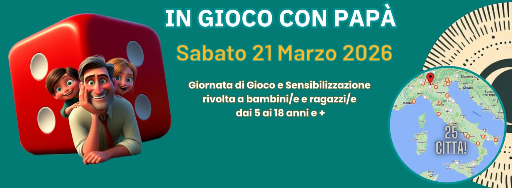
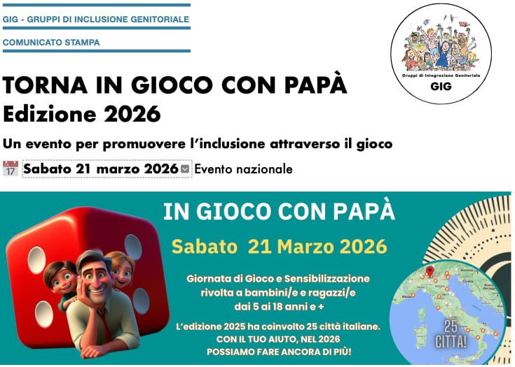
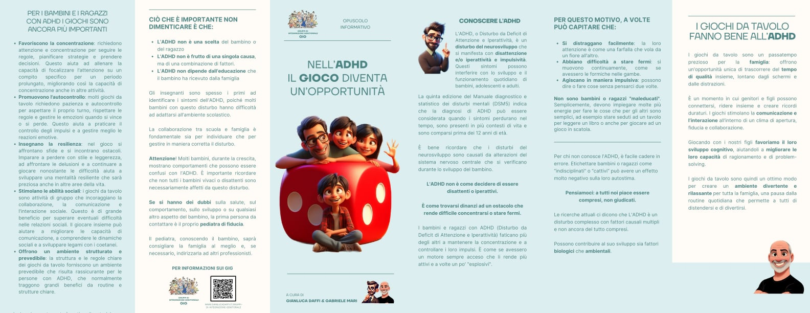

# In GIOCO con PAPÀ

> **Sabato 21 Marzo 2026 in numerose città italiane, si terrà la terza edizione di "In Gioco con Papà", un evento nazionale dedicato al gioco e all’inclusione.**

Dopo il successo delle prime edizioni del 2024 e 2025, l'iniziativa torna per offrire a bambini, ragazzi e famiglie un'esperienza di gioco condivisa e inclusiva. L'iniziativa, nata da un’idea del prof. Gianluca Daffi, promuove l'accoglienza e la cura dell'altro attraverso il gioco sano.

## 📋 Descrizione

[Scarica qui il comunicato stampa](./assets/pdf/comunicato-stampa-2026.pdf){ .md-button }

### Obiettivi dell’evento
* 🎯 **Sensibilizzare** sulle difficoltà del neurosviluppo e l'importanza dell'inclusione.
* 🎲 **Creare momenti di gioco** tra adulti e bambini, favorendo il dialogo.
* 🤝 **Promuovere la socializzazione** in spazi sicuri e accoglienti.

---

## 📅 Calendario Eventi {#eventi}

!!! info "Nota sulle date"
    L'appuntamento nazionale è fissato per **Sabato 21 Marzo 2026**. Alcune località hanno declinato l'evento in date limitrofe (es. Domenica 22) come indicato in tabella.

### 🟢 Basilicata
| Città | Luogo / Indirizzo | Orario |
| :--- | :--- | :--- |
| **Matera** | Centro LUMACA - Via Tommaso Stigliani 50 | dalle 18:00 |

### 🟢 Emilia-Romagna
| Città | Luogo / Indirizzo | Orario |
| :--- | :--- | :--- |
| **Forlì** | Via Ravegnana 166 | dalle 16:00 |
| **Marina di Ravenna** | Largo Magnavacchi 6 | dalle 16:00 |

### 🟢 Lazio
| Città | Luogo / Indirizzo | Orario |
| :--- | :--- | :--- |
| **Monterotondo** | Via 2 Giugno e Piazza Pelosi 4 | ore 15:00 e 16:30 (Dom 22) |
| **Monterotondo** | Biblioteca Torre Civica (Piazza R. Borelli) | ore 15:00 e 16:30 |

### 🟢 Liguria
| Città | Luogo / Indirizzo | Orario |
| :--- | :--- | :--- |
| **Imperia** | Via Foce 40 | dalle 15:00 |

### 🟢 Lombardia
| Città | Luogo | Indirizzo | Orario |
| :--- | :--- | :--- | :--- |
| **Brescia** | Biblioteca Casazza | Via Casazza 46 | dalle 15:00 |
| **Brescia** | Biblioteca Ghetti | Piazza Buffolli | dalle 15:00 |
| **Calvisano (BS)** | Biblioteca comunale | Via Fratelli Cervi 1 | dalle 15:00 |
| **Lovere** | Centro civico culturale | Via del cantiere | dalle 15:00 |
| **Moniga del Garda** | Biblioteca Civica | Piazza San Martino 1 | dalle 10:00 |

### 🟢 Marche
| Città | Luogo / Indirizzo | Orario |
| :--- | :--- | :--- |
| **Cupra Marittima** | Via De Gasperi 15 | dalle 15:00 (Dom 22) |

### 🟢 Piemonte
| Città | Luogo / Indirizzo | Orario |
| :--- | :--- | :--- |
| **Domodossola** | Biblioteca Civica Contini | dalle 14:30 |

### 🟢 Puglia
| Città | Luogo | Indirizzo | Orario |
| :--- | :--- | :--- | :--- |
| **Lecce** | Biblioteca Ognibene | Via M. De Pietro 17 | dalle 16:00 (Dom 22) |
| **Cavallino (LE)** | Biblioteca G. Rizzo | Via Amendola 9 | dalle 17:00 (Gio 19) |

### 🟢 Sardegna
| Città | Luogo | Indirizzo | Orario |
| :--- | :--- | :--- | :--- |
| **Carbonia** | La Clessidra | Via Arsia 108 | dalle 10:00 |

### 🟢 Toscana
| Città | Luogo | Indirizzo | Orario |
| :--- | :--- | :--- | :--- |
| **Grosseto** | Sede locale | Via Inghilterra 93 | dalle 17:00 |
| **Piombino** | Quartiere Porta a terra | Via dell’Arsenale | dalle 15:00 |

### 🟢 Trentino-Alto Adige
| Città | Luogo | Indirizzo | Orario |
| :--- | :--- | :--- | :--- |
| **Bolzano** | C. G. Villa delle Rose | Via Passaggio della Memoria 19 | dalle 10:00 |

### 🟢 Veneto
| Città | Luogo | Indirizzo | Orario |
| :--- | :--- | :--- | :--- |
| **Trevignano** | Villa Onigo | Via Mazzolaro 5 | dalle 14:00 (Dom 22) |

---

## 🕺 Partecipazione e contatti {#contatti}

**Per partecipare**, contattare i referenti di città, o compilare questa [Form di partecipazione :fontawesome-solid-paper-plane:](https://forms.gle/66Ue29J5NcWHgeDy9){ .md-button .md-button--primary }  

Per informazioni: [Gianluca Daffi](mailto:daffi.gianluca@gmail.com) - Per organizzazione: [Stefano Cecere](mailto:stefano.cecere@gmail.com)

---

## 💪🏻 Organizzazione

### FASE 1 - Incontri preliminari
Individuare un gruppo di papà disponibili a gestire mezza giornata di attività ludica con giochi in scatola suggeriti dal comitato. I papà decidono come promuovere e gestire i tavoli.

### FASE 2 - Logistica
Individuare una location adatta (comunicandola al comitato almeno 10 giorni prima) e recuperare i giochi necessari per l'evento. 

### FASE 3 - Materiale
Stampare il materiale informativo fornito in PDF. La sensibilizzazione sui temi del neurosviluppo è l'obiettivo cardine della giornata.

---

## 📖 Brochure Informativa

### ℹ️ Focus: ADHD e DOP
* **ADHD (Deficit di Attenzione e Iperattività):** Colpisce circa 3 bambini su 100. Si manifesta con disattenzione, impulsività e bisogno costante di movimento.
* **DOP (Disturbo Oppositivo Provocatorio):** Caratterizzato da umore collerico e atteggiamenti ostili che possono rendere difficili le relazioni sociali.

**Il gioco come strumento:** Aiuta a rispettare i turni, riduce l'ansia, migliora l'autostima e offre un contesto non giudicante per socializzare.

---

## 📂 Download {#materiali}

- :fontawesome-solid-book: [Brochure Informativa](./assets/pdf/brouchure-giochi-e-adhd.pdf)
- :fontawesome-solid-file-pdf: [Volantino Standard](./assets/pdf/volantino-papaingioco-17marzo2024.pdf)
- :fontawesome-solid-pen-to-square: [Volantino Personalizzabile (Canva)](https://www.canva.com/...)

---

## 🎲 Giochi Consigliati

!!! warning "Nota per gli organizzatori"
    Selezionare solo alcuni titoli in base alle caratteristiche dell’evento locale. Non è necessario utilizzarli tutti.

### :material-teddy-bear: Per i piccoli

- **C’era un Pirata** (Erickson)
    - :simple-youtube: [Tutorial](https://2042ed.org/played/boardgame/cera-un-pirata/)
    - :shopping_cart: [Editore](https://www.erickson.it/it/c-era-un-pirata)
    - *Memoria e velocità: raccogli gli oggetti del totem.*

- **A caccia di conchiglie** (Erickson)
    - :simple-youtube: [Tutorial](https://2042ed.org/played/boardgame/caccia-di-conchiglie/)
    - :shopping_cart: [Editore](https://www.erickson.it/it/a-caccia-di-conchiglie)
    - *Memoria e abbinamento sulla spiaggia.*

- **Taco gatto cacio capra pizza** (Ghenos)
    - :simple-youtube: [Tutorial](https://2042ed.org/played/boardgame/taco-cat-goat-cheese-pizza/)
    - :shopping_cart: [Editore](https://www.ghenosgames.com/it/prodotto/taco-gatto-capra-cacio-pizza/)
    - *Frenetico gioco di carte e riflessi.*

- **Ice cool** (Oliphante)
    - :simple-youtube: [Tutorial](https://2042ed.org/played/boardgame/icecool/)
    - *Abilità e "schicchere" con i pinguini.*

- **Catan junior** (Asmodee)
    - :simple-youtube: [Tutorial](https://2042ed.org/played/boardgame/catan-junior)
    - *La versione piratesca del classico Catan.*

- **Fantascatti / Fantablitz** (Giochi Uniti)
    - :simple-youtube: [Tutorial](https://2042ed.org/played/boardgame/fantascatti/)
    - :shopping_cart: [Editore](https://shop.giochiuniti.it/fantascatti-nuova-edizione.html)
    - *Associazione rapida e riflessi pronti.*

### :material-puzzle-outline: Per i grandi

- **Saboteur** (Giochi Uniti)
    - :simple-youtube: [Tutorial](https://2042ed.org/played/boardgame/saboteur/)
    - :shopping_cart: [Editore](https://shop.giochiuniti.it/saboteur.html)
    - *Ruoli nascosti, bluff e miniere d'oro.*

- **Diamant** (Mancalamaro)
    - :simple-youtube: [Tutorial](https://2042ed.org/played/boardgame/diamant/)
    - *Push-your-luck: rischia tutto per i diamanti.*

- **Carcassonne** (Giochi Uniti)
    - :simple-youtube: [Tutorial](https://2042ed.org/played/boardgame/carcassonne/)
    - :shopping_cart: [Editore](https://shop.giochiuniti.it/carcassonne-gioco-base-edizione-2021.html)
    - *Classico di piazzamento tessere medievale.*

- **King of Tokyo** (IELLO)
    - :simple-youtube: [Tutorial](https://2042ed.org/played/boardgame/king-of-tokyo/)
    - :shopping_cart: [Editore](https://iello.fr/jeux/king-of-tokyo/)
    - *Combattimento tra mostri giganti a colpi di dadi.*

- **Crossing** (Asmodee)
    - :simple-youtube: [Tutorial](https://2042ed.org/played/boardgame/crossing/)
    - *Competizione tattica per recuperare tesori.*

- **Splendor / Splendor Marvel** (Asmodee)
    - :simple-youtube: [Tutorial](https://2042ed.org/played/boardgame/splendor/)
    - :shopping_cart: [Editore](https://www.asmodee.it/product/splendor/)
    - *Strategia, gestione gemme e punti vittoria.*

---

## 🔊 Diffusione
Usiamo l'hashtag **#ingiococonpapa**. Condividi il link: [ingiococonpapa.github.io](https://ingiococonpapa.github.io)

{ width="200" }

---

## ❓ FAQ {#faq}
**Non c'è un evento nella mia città?** Puoi organizzarlo tu! Bastano 3-4 genitori volontari. Segui le fasi descritte sopra o contattaci.
**Quanto costa?** L'evento è gratuito per i partecipanti.

---

## ䷤ Chi siamo
**Comitato Organizzatore:** Gianluca Daffi, Gabriele Mari, Stefano Cecere, Jennifer Francioli, Emanuele Cristallo, Stela Gjyzelaj, Michela Savoldi, Marcello Scutra, Fausto Regosi.
